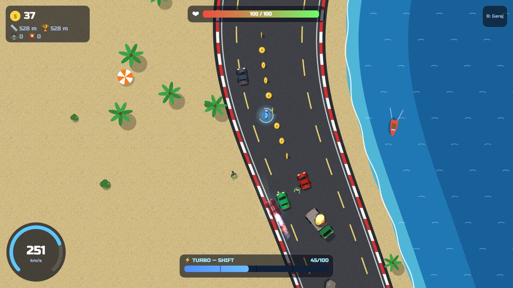
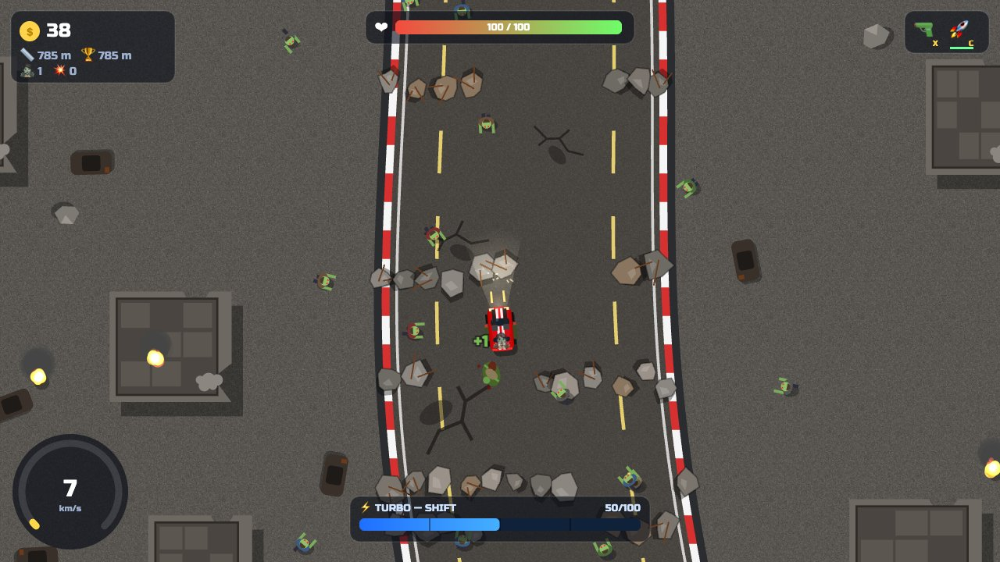
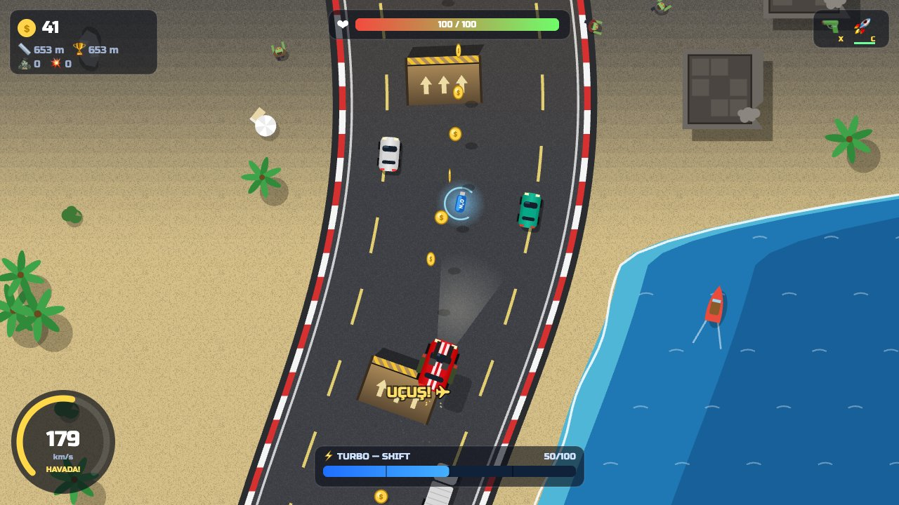

# 🏎️ Turbo Zombi Ralli

**Tarayıcıda çalışan, üstten görünümlü 2D araba yarışı oyunu.**
Virajlı yollarda turbo bas, drift at, rampalardan uç, diğer arabaları havaya uçur ve zombi dolu yıkıntı bölgelerinden sağ çık!

### 🎮 [Hemen Oyna → alperkah.github.io/CarRace](https://alperkah.github.io/CarRace/)

Bilgisayarda klavyeyle, telefon ve tablette dokunmatik butonlarla oynanır. Kurulum gerekmez.



| Yıkıntı bölgesi ve zombiler | Rampadan atlayış |
|---|---|
|  |  |

---

## ✨ Özellikler

| | Özellik | Açıklama |
|---|---|---|
| ⚡ | **Turbo** | Mavi **N₂O** tüplerinin üstünden geçince turbo dolar, **Shift** ile ateşlenir. |
| 💥 | **Patlayan arabalar** | Trafikteki arabalara çarpınca havaya uçar, yere düşünce patlarlar. Zincirleme patlamalar olabilir! |
| 🪙 | **Jeton ve garaj** | Toplanan jetonlarla garajdan yeni güçler alınır. İlerleme tarayıcıda kaydedilir. |
| 🧟 | **Zombiler** | Arabaya doğru yürürler. Silahla vur ya da ez. Yavaş kalırsan ısırırlar! |
| 🧱 | **Yıkıntılar** | Yolu kapatan molozların arasındaki boşluktan çarpmadan geçmelisin. |
| 🌊 | **Sahil yolu** | Deniz kenarından geçen yollar. Denize düşersen can kaybedersin. |
| 🛫 | **Rampalar** | Hızla üstünden geçince araba havalanır. Havadayken hiçbir şeye çarpmazsın. |
| 🌀 | **Drift** | El freni ile kaydır. Uzun drift bonus jeton ve turbo kazandırır. |
| 📱 | **Mobil uyumlu** | Telefon ve tablette dokunmatik kontroller, isteğe bağlı otomatik gaz. |
| 🔊 | **Sesler** | Tüm sesler dosya kullanmadan, kodla (Web Audio API) üretilir. |

### Bölgeler
Yol sonsuzdur ve bölgeler sırayla değişir: 🌳 **Yeşil Vadi** → 🌊 **Sahil Yolu** → ☣️ **Yıkıntı Bölgesi** → 🌵 **Çöl Otoyolu** …

---

## 🕹️ Kontroller

### Klavye

| Tuş | Görev |
|---|---|
| `↑` | Gaz |
| `↓` | Fren / geri vites |
| `←` `→` | Direksiyon |
| `Space` | El freni / drift |
| `Shift` | Turbo |
| `X` | Makineli tüfek *(garajdan alınınca)* |
| `C` | Roket *(garajdan alınınca)* |
| `B` | Garaj (mağaza) |
| `P` / `Esc` | Duraklat |
| `M` | Sesi aç / kapat |

### Dokunmatik (telefon / tablet)

- **Sol başparmak:** ◀ ▶ direksiyon
- **Sağ başparmak:** ▲ Gaz · ▼ Fren · 🌀 Drift · ⚡ Turbo · 🔫 🚀 Silahlar
- **Sağ üst:** Oto Gaz aç/kapat · 🔧 Garaj · ⏸ Duraklat
- Parmağını kaldırmadan butonlar arasında kaydırabilirsin.
- Telefonu **yatay** tutmak daha rahattır.

---

## 🔧 Garaj (Yükseltmeler)

| Simge | Yükseltme | Fiyat | Etkisi |
|---|---|---|---|
| 🔥 | 2x Turbo | 30 🪙 | Turbo deposu ve tüplerin verdiği turbo iki katına çıkar, turbo daha hızlı olur. |
| 🔫 | Makineli Tüfek | 40 🪙 | Zombileri ve arabaları vurabilirsin. |
| 💥 | Çift Namlu | 70 🪙 | Tüfek aynı anda iki mermi atar *(önce tüfek gerekir)*. |
| 🚀 | Roketatar | 90 🪙 | Patlayan roket. Yıkıntıları bile parçalar. |
| 🧲 | Jeton Mıknatısı | 35 🪙 | Yakındaki jetonlar sana doğru uçar. |
| 🛡️ | Zırhlı Tampon | 50 🪙 | +50 can, araç çarpışmalarında hasar almazsın. |
| 🔧 | Tamir Kiti | 15 🪙 | Canı tamamen doldurur *(tekrar alınabilir)*. |

**Jeton kazanma yolları:** yoldaki jetonlar (1), zombi (1), patlatılan araba (3), uzun drift (bonus).

---

## 💻 Kendi Bilgisayarında Çalıştırma

### 1. Kodları indir

**Yol A, Git ile:**

```bash
git clone https://github.com/alperkah/CarRace.git
cd CarRace
```

**Yol B, Git olmadan:** Bu sayfanın üstündeki yeşil **Code** butonuna bas ve **Download ZIP** seç, sonra ZIP'i aç.

### 2. Oyunu aç

`index.html` dosyasına **çift tıklaman yeterli**. Oyun tarayıcıda açılır, kurulum veya internet gerekmez.

### 3. (İsteğe bağlı) Telefondan oynamak için yerel sunucu

Bilgisayar ve telefon aynı Wi-Fi ağında olmalı. Proje klasöründe şunu çalıştır:

```bash
python3 -m http.server 8000
```

Sonra telefonun tarayıcısında `http://<bilgisayarın-ip-adresi>:8000` adresini aç.
(Mac'te IP adresini `ipconfig getifaddr en0`, Windows'ta `ipconfig` komutu gösterir.)

---

## 📁 Proje Yapısı

```
CarRace/
├── index.html      → Sayfa iskeleti: canvas, menüler, garaj, dokunmatik butonlar
├── style.css       → Menü, garaj ve mobil buton tasarımı
├── game.js         → Oyunun tüm mantığı ve çizimi (tek dosya, kütüphane yok)
└── docs/img/       → README görselleri
```

Oyun **hiçbir kütüphane veya framework kullanmaz**. Yalnızca HTML5 Canvas, düz JavaScript ve Web Audio API ile yazılmıştır.

### `game.js` içindeki bölümler

Dosya, `// ---------- Bölüm Adı ----------` yorumlarıyla bölümlere ayrılmıştır:

| Bölüm | Ne yapar? | Önemli fonksiyonlar |
|---|---|---|
| **Yardımcılar** | Küçük matematik araçları | `rand`, `clamp`, `lerp`, `smooth` |
| **Kayıt** | Jeton ve yükseltmeleri `localStorage`'a kaydeder | `persist` |
| **Ses** | Motor, patlama, jeton seslerini üretir | `Sound.boom`, `Sound.coin` |
| **Yol ve biyomlar** | Virajlı yolun şeklini ve bölgeleri hesaplar | `roadCX`, `roadHW`, `biomeAt`, `inWater` |
| **Dünya üretimi** | Yol ilerledikçe jeton, araba, zombi, rampa, yıkıntı yerleştirir | `genChunk`, `rubbleRow`, `spawnTraffic` |
| **Efektler** | Patlama, kan, duman parçacıkları | `explosion`, `launchCar`, `killZombie` |
| **Girdi** | Klavye tuşları | `keys`, `onPress` |
| **Dokunmatik kontroller** | Mobil butonlar, çoklu dokunuş | `applyTouches`, `syncTouchKeys` |
| **Mağaza** | Garaj ve yükseltmeler | `ITEMS`, `buy` |
| **Güncelleme** | Her karede fizik ve oyun mantığı | `update`, `updatePlayer`, `collideSolid` |
| **Çizim** | Her şeyi canvas'a çizer | `render`, `drawRoad`, `drawCarBody` |
| **HUD** | Hız göstergesi, can, turbo barı | `drawHUD`, `drawTouchHUD` |
| **Ana döngü** | Saniyede ~60 kez `update` + `render` | `frame` |

### Nasıl çalışıyor? (Kısaca)

1. **Oyun döngüsü:** `requestAnimationFrame` her karede `frame()` fonksiyonunu çağırır. Bu fonksiyon önce `update(dt)` ile dünyayı ilerletir, sonra `render()` ile ekrana çizer. `dt` iki kare arasında geçen süredir (saniye). Böylece oyun her bilgisayarda aynı hızda akar.
2. **Sonsuz yol:** Yol bir dosyadan okunmaz. `roadCX(y)` fonksiyonu birkaç **sinüs dalgasını** toplayarak her `y` için yolun ortasını hesaplar. Virajlar buradan gelir.
3. **Araba fiziği:** Hız iki bileşene ayrılır: **ileri** (`vf`) ve **yanal** (`vr`). Normalde yanal hız hızla sönümlenir (lastik tutuşu). El frenine basınca tutuş azalır, araba yana kayar ve drift oluşur.
4. **Zıplama:** Arabanın bir de yüksekliği (`z`) vardır. Rampa `z` hızını artırır, yer çekimi azaltır. Araba yüksekteyken büyük çizilir ve gölgesi uzaklaşır.
5. **Çarpışma:** Arabalar birkaç **daire** ile temsil edilir. İki dairenin merkezleri arasındaki mesafe yarıçapların toplamından küçükse çarpışma vardır.

---

## 🧑‍🏫 Öğrenciler İçin Deneme Fikirleri

Kodu değiştirip sonucu hemen tarayıcıda görebilirsin. Dosyayı kaydedip sayfayı yenilemen yeterli.

**🟢 Kolay**
- Arabanın rengini değiştir: `drawCarBody(p.w, p.l, '#e8202a', ...)` satırındaki `#e8202a` değerini değiştir.
- Maksimum hızı artır: `updatePlayer` içinde `let maxSp = onRoad ? 560 : 320;`
- Garaj fiyatlarını değiştir: `ITEMS` dizisindeki `price` değerleri.
- Yeni bir trafik rengi ekle: `CAR_COLORS` dizisi.

**🟡 Orta**
- Yolu daha geniş ya da dar yap: `roadHW` fonksiyonu.
- Virajları sertleştir: `roadCX` içindeki sinüs genlik ve periyotlarıyla oyna.
- Daha çok zombi çıkar: `genChunk` içindeki zombi sayısı.
- Yeni bir bölge ekle (örneğin ❄️ kar): `BIOME_SEQ`, `GROUND`, `ASPHALT` ve `BIOME_NAME` nesnelerine ekleme yap.

**🔴 Zor**
- Yeni bir yükseltme ekle, örneğin **Kalkan**: birkaç saniye hasar almama. `ITEMS` dizisine ekle, `save.up`'a alan aç, `hurt()` içinde kontrol et.
- Yeni bir engel türü ekle, örneğin yağ birikintisi: üstüne gelince tutuşu azaltsın.
- Zaman sınırlı **kontrol noktası** modu yap.
- İki oyunculu mod: ikinci araba `W A S D` ile kontrol edilsin.

> 💡 **İpucu:** Tarayıcıda `F12` ile geliştirici araçlarını açıp **Console** sekmesine `save.coins = 999` yazarsan jetonun 999 olur. Test için kullanışlıdır!

---

## 🌐 GitHub Pages

Bu repo GitHub Pages ile yayınlanır. `main` dalına gönderilen her değişiklik birkaç dakika içinde
**https://alperkah.github.io/CarRace/** adresinde güncellenir.

Kendi kopyanı yayınlamak istersen:
1. Repoyu **Fork** et.
2. Kendi reponda **Settings → Pages** sayfasına git.
3. **Source** olarak `Deploy from a branch`, dal olarak `main` / `(root)` seç.
4. Birkaç dakika sonra oyunun `https://<kullanıcı-adın>.github.io/CarRace/` adresinde yayında olur.

---

## 📜 Lisans

[MIT Lisansı](LICENSE). Kodu özgürce kullanabilir, değiştirebilir ve paylaşabilirsin.

İyi yarışlar! 🏁
